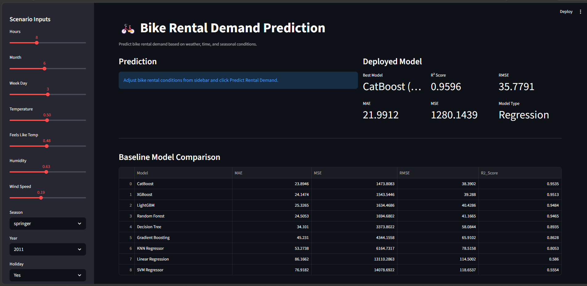
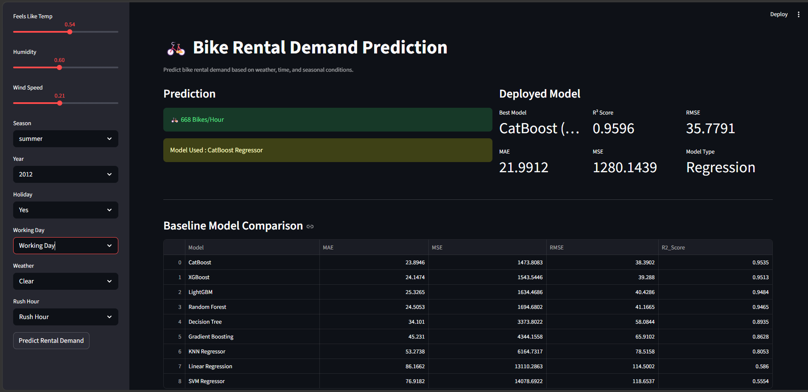
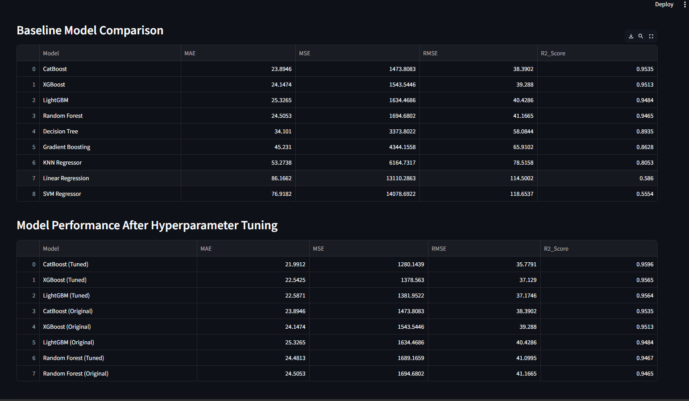

# 🚲 Bike Rental Demand Prediction

A Machine Learning Regression project that predicts the expected hourly bike rental demand based on weather conditions, seasonal patterns, and time-related features.

---

# 📌 Project Overview

Bike Rental Demand Prediction is an end-to-end Machine Learning Regression project developed to estimate the number of bikes expected to be rented in a given hour.

The project demonstrates the complete machine learning pipeline, including:

* Data Cleaning
* Exploratory Data Analysis (EDA)
* Feature Engineering
* Model Building
* Model Comparison
* Hyperparameter Tuning
* Streamlit Deployment

The final application enables users to predict bike rental demand interactively by selecting weather, seasonal, and time-related conditions.

---

# 🎯 Project Objectives

* Predict hourly bike rental demand accurately.
* Compare multiple regression algorithms.
* Improve model performance using Hyperparameter Tuning.
* Deploy the best-performing model with Streamlit.
* Build an interactive and user-friendly prediction application.

---

# 📂 Dataset Information

The dataset contains historical hourly bike rental records along with weather and calendar-related information.

## Input Features

* Hour
* Month
* Weekday
* Temperature
* Feels Like Temperature
* Humidity
* Wind Speed
* Season
* Year
* Holiday
* Working Day
* Weather Situation
* Rush Hour

## Target Variable

**Bike Rental Count (cnt)**

---

# 🛠 Data Preprocessing

The following preprocessing techniques were applied before model training:

* Missing Value Analysis
* Duplicate Record Removal
* Outlier Detection
* Feature Engineering
* One-Hot Encoding
* Feature Selection

---

# 📊 Exploratory Data Analysis

Exploratory Data Analysis was performed to understand data distribution and feature relationships.

### Analysis Performed

* Univariate Analysis
* Bivariate Analysis
* Correlation Analysis
* Distribution Analysis
* Feature Importance Analysis

---

# 🤖 Machine Learning Models Evaluated

The following regression algorithms were trained and evaluated:

* Linear Regression
* Decision Tree Regressor
* Random Forest Regressor
* Gradient Boosting Regressor
* K-Nearest Neighbors (KNN) Regressor
* XGBoost Regressor
* LightGBM Regressor
* CatBoost Regressor
* Support Vector Regressor (SVR)

---

# 📈 Baseline Model Comparison

| Model             | R² Score |
| ----------------- | -------: |
| CatBoost          |   0.9535 |
| XGBoost           |   0.9513 |
| LightGBM          |   0.9484 |
| Random Forest     |   0.9465 |
| Decision Tree     |   0.8935 |
| Gradient Boosting |   0.8628 |
| KNN Regressor     |   0.8053 |
| Linear Regression |   0.5860 |
| SVM Regressor     |   0.5554 |

---

# ⚙ Hyperparameter Tuning

Hyperparameter tuning was performed using **RandomizedSearchCV** to improve model accuracy.

### Tuned Models

* CatBoost Regressor
* XGBoost Regressor
* LightGBM Regressor
* Random Forest Regressor

---

# 🏆 Best Performing Model

**CatBoost Regressor (Hyperparameter Tuned)**

---

# 📊 Final Model Performance

| Metric   |     Score |
| -------- | --------: |
| MAE      |   21.9912 |
| MSE      | 1280.1439 |
| RMSE     |   35.7791 |
| R² Score |    0.9596 |

---

# 💻 Streamlit Web Application

An interactive Streamlit application was developed to allow users to predict bike rental demand in real time.

### User Inputs

* Hour
* Month
* Weekday
* Temperature
* Feels Like Temperature
* Humidity
* Wind Speed
* Season
* Year
* Holiday
* Working Day
* Weather Situation
* Rush Hour

### Prediction Output

* 🚲 Estimated Bike Rentals per Hour
* 🤖 Model Used: CatBoost Regressor

---

# 📷 Application Screenshots

## 🏠 Home Page



---

## 🚲 Prediction Result



---

## 📊 Model Comparison



---

# 📁 Project Structure

```text
Bike-Rental-Demand-Prediction/
│
├── app.py
├── Bike_Rental_Demand_Prediction.ipynb
├── dataset.csv
├── catboost_final_model.pkl
├── feature_columns.pkl
├── requirements.txt
├── README.md
├── .gitignore
└── images/
    ├── home_page.png
    ├── prediction_result.png
    └── model_comparison.png
```

---

# 🛠 Technologies Used

* Python
* Pandas
* NumPy
* Scikit-learn
* CatBoost
* XGBoost
* LightGBM
* Matplotlib
* Seaborn
* Streamlit
* Joblib

---

# 🚀 Installation

```bash
git clone <repository-url>

cd Bike-Rental-Demand-Prediction

pip install -r requirements.txt

streamlit run app.py
```

---

# 🔮 Future Enhancements

* Real-Time Weather API Integration
* Cloud Deployment
* Interactive Dashboard
* Advanced Feature Engineering
* Automated Model Monitoring

---

## 👨‍💻 Author

      **Akhlaque Alam**

           * Data Science Enthusiast
           * Python | SQL | Machine Learning | Streamlit
           * Open to Data Science and Machine Learning opportunities.

---

⭐ **If you found this project useful, consider giving it a Star.**
